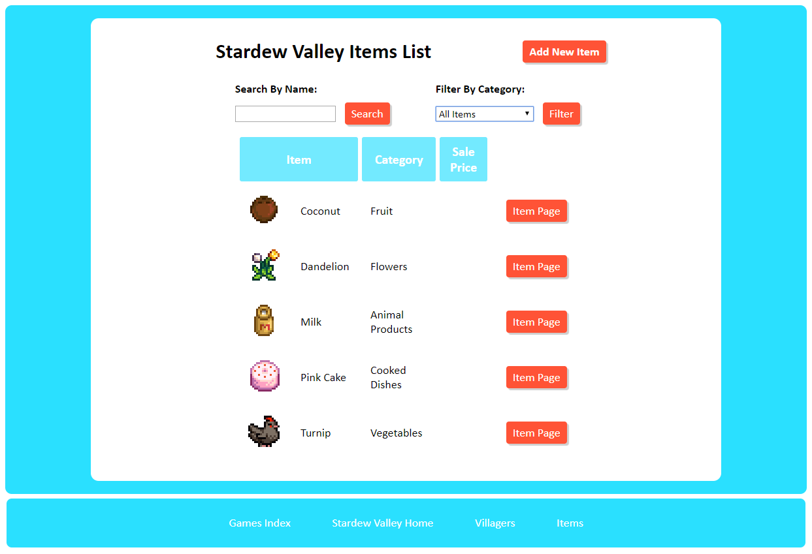

# README

# Stardew App - aka, Farming Sim Wiki #

This "Stardew App" was my first Rails project while learning Ruby on Rails.
I used it to learn and practice Rails and CSS.

It is a personal wiki that can be used to store data about NPCs while playing
farming sims like Stardew Valley, Rune Factory, etc.  Its primary purpose is
to help players keep track of NPCs' likes and dislikes for the sake of gift-giving.

## Project Status ##

### Future Updates ###

The app is in a working state, but there are other features
I would like to add at some point:

* Option to select color scheme when creating a game
* Ability to upload images when creating a new villager or item
* Login so that multiple users can keep their own wikis individually

### Current Bugs ###

Two issues I still need to fix:

* There is a bug on mobile that returns an Action Controller: Exception Caught error.
To recreate:

  1) Go to a villager or item profile page within any game.

  2) Submit a preference with error (don't pick anything).
  This will redirect you to the new preference page.

  3) Refresh / resubmit.  Choose yes if mobile browser asks if you want to resubmit.

  4) Go to villager or item index page.

  5) Refresh / resubmit.

This bug cannot be recreated on PC.  I suspect it is a post/redirect/get issue
with resubmission on mobile.

* The embedded preference form on the villager/item profile pages redirects to
preference/new upon a failed save, and then to Games/index from preference/new.

This redirect is currently a workaround: I need to figure out how to
display errors on this same page without having to render :new
and/or how to redirect back to the issuing profile page after save is successful.

## Technologies ##

The Stardew App was built in Ruby 2.4.2 and Rails 5.2.3.

I am indebted to the [Ruby on Rails Tutorial](https://www.railstutorial.org/book/beginning) by Michael Hartl
and [Rails Guides](https://guides.rubyonrails.org/getting_started.html) for helping me get started
with zero prior knowledge of Rails.
